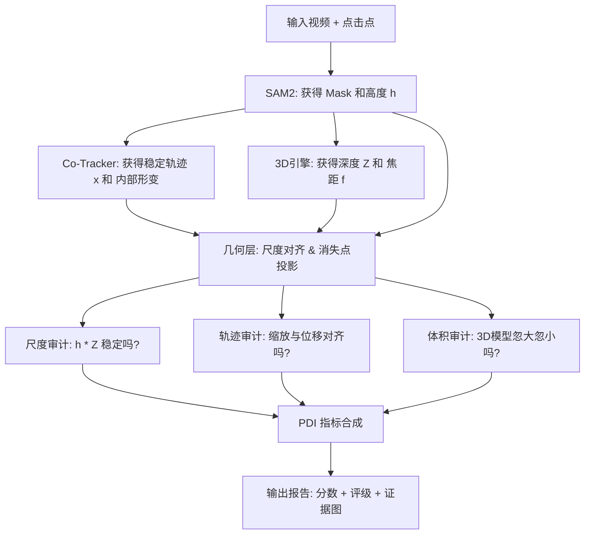

# PDI-Eval (Physical Discovery & Inspection Evaluator)

这是一个用于评估视频物理一致性的审计框架，集成了 Mega-SAM 和 Co-Tracker 等先进模型。

## 核心架构
- **perception/**: 提取场景深度、轨迹和分割掩码。
- **geometry/**: 处理齐次坐标投影与相机内外参变换。
- **evaluator/**: 核心审计逻辑，包括尺度校验与运动轨迹校验。

## 快速开始
这是一份为你精心准备的 **PDI-Eval** 项目 `README.md`。

这份文档不仅包含基础的安装步骤，还专门针对你之前遇到的 **Mega-SAM 编译报错**、**CUDA 版本冲突**以及**多模型集成**等“深坑”提供了标准化的解决方案。这对你发布论文代码、确保评审专家能够顺利运行非常有帮助。

---

# PDI-Eval: Perspective Distortion Index for AI Video World Models

**PDI-Eval** 是一个专门用于量化 AI 视频生成模型（如 Sora, Kling, Luma）**空间比例与透视一致性**的自动化评测框架。本项目通过集成 **SAM2**、**Co-Tracker** 和 **Mega-SAM**，构建了一个从 2D 像素追踪到 3D 几何还原的物理审计流水线。

---

## 🛠 1. 环境配置 (Environment Setup)

本项目对 CUDA 版本极其敏感。为了确保 **Mega-SAM** 的底层 C++/CUDA 算子能够成功编译，请务必严格遵守以下版本配比：
*   **Python**: 3.10
*   **CUDA (Toolkit & Runtime)**: 11.8
*   **PyTorch**: 2.1.0

### 1.1 创建 Conda 环境
```bash
# 创建并激活环境
conda create -n pdi_eval python=3.10 -y
conda activate pdi_eval

# 安装基础构建工具
conda install -c conda-forge gxx_linux-64=11 gcc_linux-64=11 cmake -y

# 安装匹配 CUDA 11.8 的 PyTorch 栈 (非常重要，严禁直接 pip install torch)
pip install torch==2.1.0 torchvision==0.16.0 torchaudio==2.1.0 --index-url https://download.pytorch.org/whl/cu118

# 安装环境内的 CUDA 编译器 (确保编译时 nvcc 版本对齐)
conda install -c nvidia cuda-toolkit=11.8 -y
```

### 1.2 设置环境变量
为了确保编译脚本能找到正确的 CUDA 路径，请执行：
```bash
export CUDA_HOME=$CONDA_PREFIX
export PATH=$CUDA_HOME/bin:$PATH
export LD_LIBRARY_PATH=$CUDA_HOME/lib64:$LD_LIBRARY_PATH
```

---

## 📂 2. 克隆项目与子模块 (Submodules)

本项目引用了多个外部仓库，请使用递归克隆：
```bash
git clone --recursive https://github.com/your_username/PDI-Eval.git
cd PDI-Eval

# 如果已经克隆了主仓库，请初始化子模块
git submodule update --init --recursive
```

---

## 🏗 3. 编译与安装 (Installation)

### 3.1 安装 SAM2 & Co-Tracker
```bash
# 安装 SAM2
pip install git+https://github.com/facebookresearch/segment-anything-2.git

# 安装 Co-Tracker
pip install git+https://github.com/facebookresearch/co-tracker.git

# 安装其他基础依赖
pip install -r requirements.txt
```

### 3.2 编译 Mega-SAM 底层算子 (手术式拆分安装)
由于 Mega-SAM 的 `base/setup.py` 包含双重调用 Bug，必须手动拆分安装。我们已在 `third_party/mega_sam/base/` 预置了拆分脚本：

```bash
cd third_party/mega_sam/base

# 备份原文件
mv setup.py setup_org.py

# 1. 安装 droid_backends
cp setup_droid.py setup.py
pip install -e . --no-build-isolation

# 2. 安装 lietorch
cp setup_lie.py setup.py
pip install -e . --no-build-isolation

# 还原
mv setup_org.py setup.py
cd ../../../

pip install torch-scatter -f https://data.pyg.org/whl/torch-2.1.0+cu118.html
```

---

## 🧠 4. 模型权重 (Checkpoints)

请下载以下权重并放入 `checkpoints/` 对应目录（详细链接见项目 Wiki）：
*   `sam2_hiera_large.pt` -> `checkpoints/sam2/`
*   `cotracker2.pth` -> `checkpoints/tracker/`
<!-- *   `dust3r_vitl14_target_space.pth` -> `checkpoints/geometry/` -->
*   `depth_anything_vitl14.pth` -> `third_party/mega_sam/Depth-Anything/checkpoints/` （wget https://huggingface.co/spaces/LiheYoung/Depth-Anything/resolve/main/checkpoints/depth_anything_vitl14.pth）
*   `raft-things.pth` -> `third_party/mega_sam/cvd_opt/` 
（pip install gdown

cd third_party/mega_sam/cvd_opt/

gdown 1R8m_jMvCun-N45XkMvHlG0P38kXy-h6I）
---


## 🚀 6. 快速开始 (Quick Start)

通过 PDI 判别式对视频进行空间一致性审计：

```bash
python main.py --input data/demo_video.mp4 --points "[450, 600]" --labels "[1]"
```

### 核心审计逻辑：
1.  **SAM2**: 提取物体掩码及像素高度 $h$。
2.  **Co-Tracker**: 追踪物体底部消失点收敛轨迹 $x$。
3.  **Mega-SAM**: 还原三维深度 $Z$ 及相机位姿。
4.  **PDI Evaluator**: 计算 $\epsilon = |\frac{h_1}{h_2} - \frac{x_1-c_x}{x_2-c_x}|$ 并合成最终透视畸变指数。

---


##  7. 文件功能详细说明

PDI-Eval/
├── checkpoints/              # 权重文件 (.pt, .pth)
├── data/                     # 本地测试数据 (mp4, images)
├── scripts/                  # 自动化脚本
│   ├── setup_env.sh          # 环境配置与编译脚本
│   └── download_weights.sh   # 权重下载脚本
├── third_party/              # Git 子模块（源码级依赖）
│   ├── mega_sam/             # Mega-SAM 仓库
├── tests/                    # 单元测试（针对几何公式和 Mock 数据）
├── src/                      # 核心源代码根目录
│   └── pdi_eval/             # 统一命名空间包
│       ├── __init__.py       # 暴露核心类和版本信息
│       ├── pipeline.py       # 总控中心：管理模型加载/释放与数据流转
│       ├── perception/       # 感知层：负责“提取证据”
│       │   ├── __init__.py
│       │   ├── base.py       # 抽象基类 & PerceptionResult 数据定义
│       │   ├── sam_wrapper.py     # SAM2: 锁定 2D 标靶 (h, x)
│       │   ├── track_wrapper.py   # Co-Tracker: 追踪像素锚点
│       │   ├── mega_sam_wrapper.py# Path A: 基于物体的 3D 还原
│       ├── geometry/         # 数学层：负责“定义真理”（纯数学，无模型）
│       │   ├── __init__.py
│       │   ├── camera.py     # 相机投影、坐标对齐、内参处理
│       │   └── projection.py # H-X 齐次性公式、消失点计算、1/Z 规律
│       ├── evaluator/        # 审计层：负责“对比查账”（计算残差 ε）
│       │   ├── __init__.py
│       │   ├── scale_audit.py   # 尺度审计：h 与 Z 的匹配度
│       │   ├── motion_audit.py  # 轨迹审计：位移与缩放的耦合度 (H-X)
│       │   └── volume_audit.py  # 3D 审计：3D 空间下的体积守恒性
│       ├── metrics/          # 指标层：负责“汇总打分”
│       │   ├── __init__.py
│       │   └── pdi_index.py     # PDI 指标合成算法 (RMSE + 加权)
│       ├── data/             # 数据管理层：负责“后勤保障”
│       │   ├── __init__.py
│       │   ├── video_loader.py  # 视频读写、帧采样、图像预处理
│       │   └── cache_manager.py # .npz 缓存管理（调试利器）
│       └── utils/            # 工具层：负责“辅助呈现”
│           ├── __init__.py
│           ├── logger.py        # Rich 风格的漂亮日志输出
│           └── visualizer.py    # 结果绘图、3D点云与透视线可视化
├── main.py                   # 命令行唯一入口
├── app.py                    # Hugging Face Space (Gradio) 网页入口
├── setup.py                  # 将 pdi_eval 安装为可导入包
├── requirements.txt          # 基础依赖
└── README.md                

 # 项目说明文档

---

## 📊 8. 结果示例 (Results)

| 视频类型 | 现象描述 | PDI 评分 (越低越好) | 结论 |
| :--- | :--- | :--- | :--- |
| 真实拍摄 | 比例与位移完美同步 | 0.04 | 物理真实 |
| AI 生成 A | 越跑越快，体积缩放滞后 | 0.85 | 严重透视畸变 |
| AI 生成 B | 物体移动时背景滑步 | 1.22 | 几何逻辑崩溃 |

---


## 📜 9. 引用 (Citation)

如果您在研究中使用了本项目或 PDI 指标，请引用：

```bibtex
@article{yourname2025pdi,
  title={PDI-Eval: Quantitative Auditing of Perspective Consistency in Video World Models},
  author={Your Name and Collaborators},
  journal={arXiv preprint},
  year={2025}
}
```

---
**License**: MIT (Core Code) / Apache-2.0 (Mega-SAM)


目前的 **PDI-Eval** 运行逻辑已经演变成了一个**“多维数据提取 -> 物理规律校验 -> 结果量化汇报”**的自动化审计流水线。

为了让你更直观地理解，我将整个运行过程拆解为四个关键层级：

---

### 第一层：感知层 (Perception Layer) —— “提取物证”
这是流水线的起点，负责从原始像素中挖掘出三维几何信息。

1.  **SAM2 (锁定目标)**：
    *   **输入**：视频 + 你点击的一个点。
    *   **输出**：每一帧的物体掩码（Mask）。
    *   **作用**：明确“审计对象”是谁。通过 Mask 计算出每一帧的**像素高度 $h(t)$**。
2.  **Co-Tracker (锚点追踪)**：
    *   **输入**：视频 + SAM2 的第一帧 Mask。
    *   **输出**：物体身上 100 个关键像素点的长程轨迹。
    *   **作用**：**这是最稳的 2D 坐标来源**。它不仅能提供更平滑的横坐标 $x(t)$，还能通过点与点之间的距离变化来检测“体积呼吸感”。
3.  **3D 引擎 (Mega-SAM 或 Dust3R)**：
    *   **输入**：视频 + Mask。
    *   **输出**：**深度序列 $Z(t)$**、相机内参 $f$、相机位姿 $[R|t]$。
    *   **作用**：将视频从 2D “升维”到 3D。

---

### 第二层：几何层 (Geometry Layer) —— “统一度量衡”
感知模型输出的数据通常是乱序或尺度不一的，几何层负责把它们调教好。

1.  **尺度归一化 (Scale Alignment)**：
    *   单目重建的深度 $Z$ 可能是 0.1，也可能是 100。
    *   **做法**：将所有深度除以第一帧的值，使其在 `1.0` 附近的单位空间内波动。
2.  **坐标系对齐**：
    *   利用相机外参，确保物体的位移是在同一个“世界坐标系”下衡量的，排除相机抖动的干扰。

---

### 第三层：审计层 (Evaluation Layer) —— “逻辑查账”
这是你研究的核心数学部分。它拿着上面的数据去套物理公式。

1.  **尺度审计 (`scale_audit`)**：
    *   **查账逻辑**：检查 $h(t) \times Z(t)$ 是否等于常数。
    *   **发现幻觉**：如果 $Z$ 变大一倍，$h$ 却没缩小一半，记为**尺度不一致（体积突变）**。
2.  **轨迹审计 (`motion_audit`)**：
    *   **查账逻辑**：检查 $\frac{h_1}{h_t}$（变小的比例）是否等于 $\frac{x_1 - c_x}{x_t - c_x}$（向中心靠拢的比例）。
    *   **发现幻觉**：如果物体变小得很快，但位置没往中间挪，记为**运动不匹配（滑步）**。
3.  **体积审计 (`volume_audit`)**：
    *   **查账逻辑**：在 3D 点云里量身高，并在 2D 追踪点里量相对距离。
    *   **发现幻觉**：如果 3D 身高忽大忽小，记为**物理本体不稳定（呼吸感）**。

---

### 第四层：合成层 (Metrics & Synthesis) —— “宣判结果”

1.  **PDI 指标合成**：
    *   汇总各项审计的残差序列。
    *   使用 **RMSE (均方根误差)** 计算总分。
    *   **输出**：PDI 指数（例如 0.42）和评级（例如 Grade C）。
2.  **可视化物证生成**：
    *   绘制**残差波动曲线**（找出逻辑崩塌的具体帧）。
    *   生成**透视线叠加视频**（让用户肉眼看到消失点的偏移）。

---

### 总结：数据流转全景图



### 为什么现在的逻辑是“合理”的？

*   **缓存机制 (Cache)**：你不用每次改公式都跑一遍 SAM2/Mega-SAM，极大节省了 Debug 时间。
*   **Mega-SAM 引擎**：使用基于物体的 3D 深度还原方案。
*   **点追踪引入**：解决了单纯依靠 Mask 带来的边缘抖动噪声，使你的轨迹审计（Motion Audit）有了真正的物理锚点。


## 一些细节+可改进的点


### 一、 Co-Tracker 是怎么撒点的？

Co-Tracker 并不是“盲目”撒点，它主要有两种模式：

1.  **网格撒点 (Grid Sampling - 默认模式)**：
    *   它在图像上铺设一个等间距的网格（例如 $20 \times 20$）。
    *   **在你的项目中**：我们会先拿到 SAM2 的 Mask。代码逻辑会判断：**“如果网格点落在 Mask 内部，则保留；如果落在外面，则丢弃。”**
    *   **优势**：保证了点在物体表面分布均匀，能完整捕捉物体的形变。

2.  **特征点撒点 (Feature-based Sampling)**：
    *   利用算法（如感知权重）在纹理丰富的地方撒点。
    *   **优势**：追踪极其稳健，不容易丢点。

**代码实现建议**：在 `track_wrapper.py` 中，你可以直接调用 `grid_size` 参数。它会自动在 Mask 区域内均匀布点。

---

### 二、 SAM2 如何实现自动化定标（摆脱手动输入坐标）？

要让模型自动识别“主要物体”，你目前有三个成熟的技术路径：

#### 路径 A：Grounded-SAM2（最推荐，最专业）
这是目前学术界最通用的方案。
*   **做法**：在 SAM2 前面挂一个 **Grounding DINO** 模型。
*   **逻辑**：你输入文字指令（例如 "train" 或 "running person"）。Grounding DINO 会在第一帧自动画出这个物体的 Bounding Box，然后计算 BBox 的中心点，自动传给 SAM2。
*   **优点**：完全自动化，且能根据语义精确锁定你要审计的目标。

#### 路径 B：显著性目标检测 (Saliency-based)
*   **做法**：利用模型识别画面中最吸引眼球的区域。
*   **逻辑**：通常 AI 视频的主角都在画面中心且占据较大比例。直接取第一帧 Mask 面积最大的物体作为审计对象。

#### 路径 C：自动全图分割 (Everything Mode)
*   **做法**：运行 SAM2 的 `generate` 模式（不给点，分出所有东西）。
*   **逻辑**：通过规则过滤，比如“选取位移最大”或“面积最大且靠中心”的实例。

---

### 三、 如果 Mega-SAM 重建坏了怎么办？（核心风险控管）

这是一个非常现实的问题：**如果“尺子”本身就是弯的，怎么量出视频的对错？** 

重建质量差（$Z$ 值乱跳）确实是目前 3D 视觉的痛点。为了保证你的实验效果，你需要引入 **“鲁棒性审计” (Robustness Audit)**：

#### 1. 引入置信度图 (Confidence Map)
*   Mega-SAM 会输出一个**置信度评分**。
*   **策略**：在计算 PDI 指标时，如果某几帧的重建置信度低于阈值，**直接剔除这些帧**，不计入评分。这能保证你的 PDI 分数是由“可靠的 3D 数据”算出来的。

#### 2. 时域平滑过滤 (Temporal Smoothing)
*   **策略**：物理世界的深度 $Z$ 不可能在 1/30 秒内突变 5 米。如果算出来的 $Z$ 序列波动率（一阶差分）超过了物理极限，我们就判定为**重建失败**而非视频幻觉。

#### 3. 接入一个api
是在mega-sam输出之后的结果，对这个结果进行评估

#### 4. 对实验效果的影响
如果 Mega-SAM 彻底重建不出 3D 结构，你的 PDI 框架会陷入“无话可说”的境地。
*   **在论文中你可以这样处理**：将“重建成功率”作为 PDI-Eval 的一个前置指标。如果一个 AI 视频扭曲到连专业的重建引擎都无法处理，这本身就说明该视频的**几何一致性极低（Fail 级别）**。

---


## 有关运行一次的时间，有无要求


## 代码要做到什么程度？


## 要测试多少个视频模型？用开源的吗？闭源的模型是直接接入api，输入prompt让它生成，再进行检测
seekdance

测试几类视频，每类视频有几个video,(一共二三十个min)
test as much as you can

## 有关timeline，3月5号截止，什么时候将初稿写好比较合适呢？
overleaf


## real和fake的对比（明天完成）
目前可以先测三四个。

要理解 SAM2 自动识别物体的逻辑，我们需要区分两个层面：**SAM2 自身的“分出所有东西”能力**，以及我们通过插件（如 Florence-2）实现的**“理解名字并识别”能力**。

简单来说，SAM2 本质上是一把**“万能剪刀”**，它知道哪里是物体的边界，但它默认并不知道这个物体叫什么。

以下是 SAM2 自动识别的三种主要逻辑路径：

---

### 1. 语义识别逻辑：Florence-2 / Grounding DINO + SAM2
这是你目前代码中使用的逻辑（**最聪明、最常用的自动化方式**）。

*   **逻辑链条**：**看到文字 -> 找到框 -> 传给 SAM2**。
*   **具体步骤**：
    1.  **文本理解**：你输入 "train"（火车）。
    2.  **目标检测（检测器）**：Florence-2 或 Grounding DINO 这种“大脑”模型先扫描图片。它们经过了海量图文对训练，知道“火车”长什么样。
    3.  **坐标锁定**：检测器在图上画一个矩形框（Bounding Box），确定火车的范围。
    4.  **提示点生成**：我们取这个矩形框的**中心点**，作为“提示点（Prompt Point）”传给 SAM2。
    5.  **精准分割**：SAM2 接收到点后，利用其强大的边缘感知能力，把火车的精确轮廓抠出来。

---

### 2. 几何发现逻辑：SAM2 的 "Everything" 模式
这是 SAM2 官方自带的自动化逻辑。

*   **逻辑链条**：**地毯式搜索 -> 过滤 -> 产出实例**。
*   **具体步骤**：
    1.  **全图撒点**：模型在整张图片上均匀地铺设一个点阵（例如 32x32 个点）。
    2.  **并行分割**：对每一个点，SAM2 都会尝试预测它所属的物体掩码（Mask）。
    3.  **去重与过滤 (NMS)**：因为一个物体上会有多个点，会产生重复的 Mask。模型通过“交并比 (IoU)”和“稳定性分数”剔除重叠的和质量差的掩码。
    4.  **结果**：它会把图里所有的石头、草地、火车、云朵全部标出来。
*   **缺点**：它分出了 100 个物体，但它不知道哪个是你要审计的“火车”。

---

### 3. 时空连续逻辑：SAM2 的视频记忆机制
这是 SAM2 为什么能“自动”在视频里一直盯着某个物体的核心。

*   **逻辑链条**：**第一帧特征 -> 存入记忆库 -> 后续帧匹配**。
*   **具体步骤**：
    1.  **记忆编码 (Memory Encoding)**：一旦第一帧的火车被锁定（无论是你点的还是自动检测的），SAM2 会提取火车的视觉特征、形状、位置。
    2.  **记忆银行 (Memory Bank)**：它把这些特征存进一个缓存区（包含最近的帧和最早的帧）。
    3.  **预测下一帧**：处理下一帧时，SAM2 的注意力机制（Attention）会去记忆银行里找：“谁跟刚才那个火车最像？”
    4.  **自动修正**：即便火车变大、变小、部分遮挡，记忆机制也能通过历史特征自动补全现在的掩码。

---

### 4. 总结：在你的 PDI-Eval 项目中，逻辑是怎样的？

你现在的 **全自动版本**（使用 `--text "train"`）逻辑如下：

1.  **Florence-2 (大脑)**：在视频第 1 帧搜索符合 "train" 语义的物体。
2.  **转化为 Prompt**：将找到的物体中心坐标 `[x, y]` 给 SAM2。
3.  **SAM2 (剪刀+记忆)**：
    *   在第 1 帧抠出火车轮廓。
    *   通过**记忆银行**自动在接下来的 400 多帧里“粘”住这辆车。
    *   **自动提取**：代码从每一帧生成的 Mask 中自动计算高度 $h$ 和质心 $x$。

### 💡 为什么这种“组合逻辑”对你的研究最有利？

因为你要做 **Benchmark (基准测试)**。
*   如果靠人手动点，每次点的位置稍有偏差，PDI 分数就会变，实验就不可复现。
*   **全自动语义逻辑** 保证了：只要输入 "train"，系统每次都会以同样的方式锁定物体中心，你的 PDI 评估结果才是**客观、可复现、具备学术公信力**的。